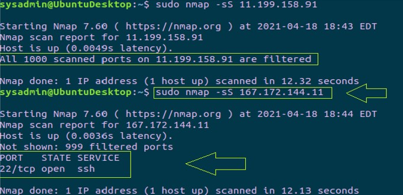
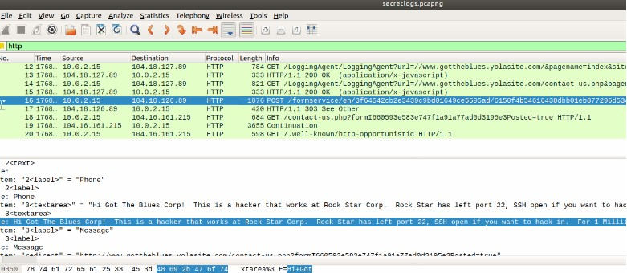

# Network Vulnerability Assessment 

**Phase 1:**
- Determine the IPs for the Hollywood office in order to determine which IP is accepting connections.
    - RockStar Corp doesn't want any of their servers, even if they are up, indicating that they are accepting connections.

```
fping -g server IP address
```

 IP Address | Location | State |
 -----------|----------|-------|
15.199.95.91/28 | Hollywood Database Servers | Unreachable
15.199.94.91/28 | Hollywood Web Servers | Unreachable
11.199.158.91/28 |Hollywood Web Servers | Unreachable
167.172.144.11/32 | Hollywood Application Servers | Alive
11.199.141.91/28 | Hollywood Application Servers | Unreachable

**vulnerabilities discovered:**
- The server that holds the IP 167.172.144.11/32 indicates that accepts connection. A hacker could establish a connection and attack the server.

**List any findings associated with a hacker:**
- there is no findings associated with a hacker. Only possible exploites.

**Document the mitigation recommendations to protect against the discovered vulnerabilities:**
- A mitigation option would be opening sessions, ensuring they remain open and functional while data is being transferred, and closing them when communication ends.

**Document the OSI layer where the findings were found:**
- The findings correspond to Network layer-3

<br>
<br>

**PHASE 2**

**List the steps and commands used to complete the tasks:** 
```
     Sudo nmap -sS IP address 
    -sS: Scan using TCP SYN scan (default) 
```

**List any vulnerabilities discovered**
- Port 22 open accepting ssh connection


 
**List any findings associated to a hacker:**
- To be secured, the port should not show up on the scan.

**Document the mitigation recommendations to protect against the discovered vulnerabilities:**
- A 22-ssh port open attract attacker to attempt login multiple times per day. The attackers can use kiddie-scripts testing for default or common login and passwords. Which can create a total waste of the server resources, and a huge security risk. A mitigation recommendation is to keep the port 22 closed, and restrict access by only the allowed IP addresses. 

**Document the OSI layer where the findings were found:**
- The findings correspond to the layer 4 transport.

<br>
<br>

**PHASE 3**

**List the steps and commands used to complete the tasks:**
- Command to access the server: 

        ssh target-username@target-IP
        ssh jimi@167.172.144.11

        nslookup 98.137.246.8
<br>

**List any vulnerabilities discovered:**
- Attackers could access port 22, since it is open.

**List any findings associated to a hacker:**
- On `/etc/hosts` file the `rollingstone.com IP 167.172.144.11` was replaced by the `IP 98.137.246.8`, that corresponds to unknown.yahoo.com website. 

**Document the mitigation recommendations to protect against the discovered vulnerabilities:**
- Remove the redirection to the unknown.yahoo.com.
- Change the password.

**Document the OSI layer where the findings were found:**
- Layer 7-Application

<br>
<br>

**PHASE 4**

**List the steps and commands used to complete the tasks:**
- On terminal: `cat /etc/packetcaptureinfo.txt` 
- On wireshark: `arp` and `http`

**List any vulnerabilities discovered:**
- Weak network security.

**List any findings associated to a hacker:**
- ARP spoofing (Address Resolution Protocol) and spoof IP address.
- On Wireshark, in the Packet Dedails section, was found a conversation between a hacker and an employee about the Rock Star open port (22/ssh). The hacker was asking for a bribe of 1 million dollars to provide the username and password.



**Document the mitigation recommendations to protect against the discovered vulnerabilities:**
- Monitore networks for atypical activity. Deploy packet filtering to detect inconsistencies, like outgoing packets with source IP addresses that don't match those on the organization's network, use robust verification methods (even among networked computers), authenticate all IP addresses, and use a network attack blocker. Place at least a portion of computing resources behind a firewall. Use IPv6 instead of IPv4.

**Document the OSI layer where the findings were found:**
- Layer 3-Network
